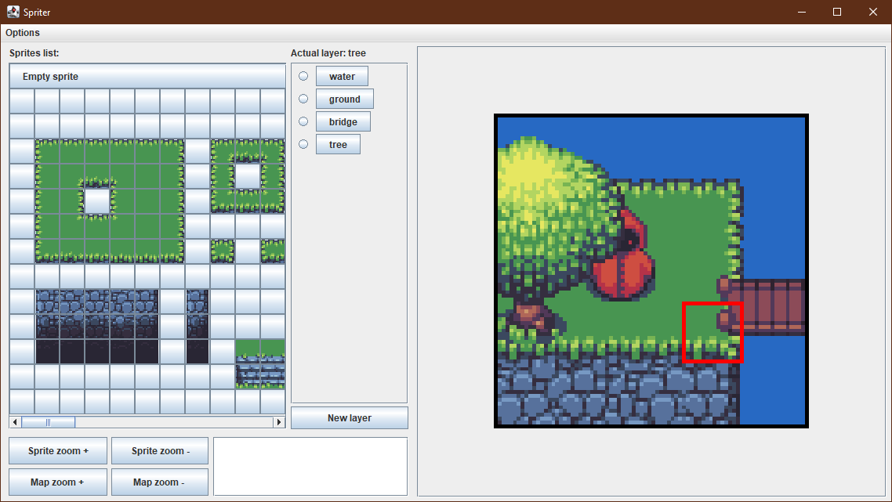

# Sprite sheet tool, by jfrNebus
 
> [!IMPORTANT]
> El proyecto no está terminado. Aun queda mucho código que limpiar y corregir.
> 
> The proyect is still under developement. There's still a lot of code to clean and fix.
>
> For english speakers [click here](#intro) 🇬🇧

<br>

<hr> 

### 🇪🇸

### Introducción

SpriteSheeter es una herramienta pasada para poder gestionar de una forma más sencilla, un aspecto de uno de los 
proyectos en los que estoy trabajando.

Empecé un juego 2D de gráficos de tipo pixel art, lo estaba desarrollando para Android con una interfaz de usuario
básica a modo de prueba. Aunque el proyecto estaba en una etapa muy inicial, desarrollé el sistema para convertir 
en objetos individuales cada uno de los sprites de un sprite sheet dado. Adicionalmente, este sistema me permite 
gestionar un canvas de X medidas, adecuando la resolución del mismo a la pantalla del dispositivo, teniendo en 
cuenta el valor DPI de la misma.

Hace poco recuperé este proyecto después de dejarlo abandonado por un tiempo largo. Al intentar acordarme de cómo
funcionaba todo, lo primero en lo que pensé fue que la forma de crear el mapa era muy tediosa, necesitaba una 
herramienta para gestionarlo.


<br>

### El problema :finnadie:

Nunca he mirado de qué forma se crea un juego 2D de gráficos tipo pixel art. Lo única información al respecto que he 
recibido de internet, es que la idea principal es trocear la imagen del sprite sheet en imagenes más pequeñas para 
usarlas como objetos dentro del código. Es decir, solo existe un único elemento multimedia.

Entendemos como sprite sheet aquella imagen que está compuesta por imágenes más pequeñas, que representan un elemento de
cada tipo posible dentro del juego. En un sprite sheet también podemos encontrar el conjunto de frames que forman una
animación. De esta forma, en un juego como Mario Bros, el suelo está formado por la repetición de un único cuadrado de
piedra, las largas plataformas flotantes de ladrillo están formadas por el mismo bloque de ladrillo repetido un número
determinado de veces, etc.

Al final terminé con un sistema que dividía el sprite sheet en imágenes más pequeñas que podía usar como sprites. El 
sistema los creaba de forma anónima, la identidad la recibían por parte de una colección de tipo Map, que asignaría a
cada sprite un elemento _key_ cuyo valor sería un número. De esta forma, el primer sprite de la esquina superior izquierda
sería el sprite 0, el siguiente sprite de esa primera fila sería el sprite 1, y así sucesivamente, en función de las filas
y columnas del sprite sheet. Entendiendo esto, se puede construir una imagen más grande, a partir de imagenes pequeñas, 
mediante el ID de cada sprite.

<br>
<br>

<p align="center">
  
</p>

Imaginemos que lo que se ve en la imagen anterior es, un arbol... 😵. El arbol de la izquierda es el sprite sheet, tiene
un modelo de cada sprite que forma el arbol. A base de repetir algunos de esos sprites se ha creado un arbol mayor en la
imagen de la derecha. Si construimos el sistema adecuado, uno que permita, a partir de un listado de ids, crear una 
imagen con los sprites correspondientes a cada id, podremos crear mapas a partir de arrays bidimensionales, teniendo un 
único elemento multimedia, el sprite sheet original.

```
int[][] newMap = {
{0, 1, 2},
{3, 4, 5},
{3, 4, 5},
{6, 7, 8},
{9, 10, 11},
{9, 10, 11},
{12, 13, 14},
};
```

El sistema iteraría sobre el array newMap, siendo que cada array dentro newMap representaría una fila del canvas, y
los elementos de cada fila serían los sprites de la misma. De esta forma, todos los elementos número 0 de cada array
forman la columna 0, los elementos número 1 forman la columna 1, y los elementos número 2 forman la columna 2. Este 
ejemplo es fácil de seguir, es una imagen pequeña, crear arrays bidimensionales se complica cuando el mapa a crear es
más grande y/o complejo.

<br>

<p align="center", background="black">
 <b>Test canvas</b>
 <br>
 <br>
  
   
 
</p>

<br>

La última imagen de la derecha, arriba mostrada, se forma a partir de la superposición de las cuatro capas previas. Cada
capa consta de una serie de sprites.

<br>

```
int[][] default_layer = {
{169,169,169,169,169},
{169,169,169,169,169},
{169,169,169,169,169},
{169,169,169,169,169},
{169,169,169,169,169}
};

int[][] new_layer = {
{0,0,0,0,0},
{104,104,104,108,56},
{209,209,209,159,56},
{311,311,311,312,0},
{412,412,412,413,0}
};

int[][] new_layer_2 = {
{216,216,216,0,0},
{216,377,378,0,0},
{216,428,429,474,475},
{216,216,216,525,526},
{0,0,0,0,0}
};

int[][] new_layer_3 = {
{71,72,216,216,66},
{122,123,124,0,0},
{173,174,0,0,0},
{224,227,0,0,0},
{0,0,0,0,0}
};

```

<br>

Como se puede apreciar, intentar crear los arrays bidimensionales de una imagen tan simeple como esa, un canvas de
80x80 pixels con 5 sprites por fila, cada sprite de 16 pixels de lado, puede llegar a ser bastante complicado. 
Intentar lograr dicha hazaña para mapas grandes, de varios cientos de sprites por lado e incluso más, queda
descartado.

<br>

### La herramienta 🧰
 
<br>
  
 <p align="center", background="black">
  
 </p>

A la vista queda que no soy ningún profesional a la hora de crear interfaces de usuario 😆. Pese a ello, cumple
con lo que buscaba.

Lo primero que se nos muestra al ejecutar la aplicación, es una ventana pequeña donde se podrá seleccionar, mediante
un cuadro de busqueda al hacer clic sobre el campo de texto del apartado _path_, la imagen que deseamos usar como 
sprite sheet. Adicionalmente, se tendrá que establecer el lado en pixels de cada sprite, y el lado en pixels del 
canvas con el que vamos a trabajar. 

Una vez se han rellenado los campos solicitados y se accede a la pantalla principal, se observan una serie de partes 
bien definidas. A la izquierda se encuentra un apartado en el que se muestran un conjunto de botones con la imagen 
de cada sprite, del sprite sheet facilitado. En este caso se está usando un [sprite sheet](SpriteSheeter/Resources/tiles.png)
del artista . Haciendo clic en cada uno de ellos, se podrá imprimir dicho sprite en el
cuadrado rojo dentro del canvas que aparece en la parte derecha de programa. En el medio, se encuentra una lista con los 
botones de acción de cada capa. Cada check box radial ocultará la capa a la que acompañe, y cada botón de capa 
establecerá la capa actual sobre la que se imprimirá cada sprite.

Se podrá mover el cursor, el cuadrado rojo, sobre el mapa, mediante las teclas de dirección o mediante las teclas _a w
s d_. Adicionalmente, manteniendo la tecla Shift y presionando alguna de las teclas dereccionales mencionadas 
anteriormente, se podrá mover el sprite sheet dentro del apartado _Sprites list_. Presionando Shift más la tecla +,
se aumentará el tamaño de visualización de los sprite dentro de la lista de sprites; ocurrirá lo contrario si la 
combinación de teclas es Shift y la tecla -. Se podrá modificar el tamaño del canvas si se presiona la tecla Ctrl y
las teclas + y -. La tecla Enter modificará el estado del cursor, pasando de color rojo a color verde. Esto indica,
que se imprimirá, automáticamente, el último sprite que se haya seleccionado con el ratón en la lista de sprites, en 
cualquier ubicación a la que se mueva el cursor, hasta que el cursor vuelva a ser de color rojo. 

En la parte superior izquierda se encuentra un menú desplegable que permitirá realizar diversas acciones. Se podrán
gestionar las capas, pudiendo borrar o eliminar la capa actual, o todas las capas a la vez; importar o exportar un
archivo de texto _.txt_ para poder guardar o cargar el trabajo realizado; exportar en formato _.png_ el canvas actual,
siendo que las capas ocultas no se imprimirán; o leer una pequeña leyenda donde se informa de los atajos de teclado.

Por último, en la parte inferior izquierda se encuentran una serie de botones para controlar el nivel de zoom aplicado 
sobre la lista de sprites y sobre el mapa; un bloque de texto donde podremos escribir el nombre de las capas que deseemos 
agregar, o donde se mostrará el texto generado cuando se seleccione la opción de exportar código; y el botón de nueva 
capa, que creará una nueva capa tomando como nombre el texto que hayamos introducido, en formato ASCII, en el campo
de texto.

<br>

### El fruto 🍓🍌🥝
 
<br>

El objetivo final de la aplicación no es conseguir la imagen final, el canvas es solo la guía para que aquel que está 
creando el mapa. El objetivo final es obtener el bloque de codigo generado en el archivo _.txt_ al seleccionar la opción
_Export code_. 

```
//Sprites in side = 5

##PATH##

-
//Layer: default_layer
int[][] default_layer = {
{169,169,169,169,169},
{169,169,169,169,169},
{169,169,169,169,169},
{169,169,169,169,169},
{169,169,169,169,169}
};
//default_layer:169 169 169 169 169 169 169 169 169 169 169 169 169 169 169 169 169 169 169 169 169 169 169 169 169 
-
-
//Layer: new_layer
int[][] new_layer = {
{0,0,0,0,0},
{104,104,104,108,56},
{209,209,209,159,56},
{311,311,311,312,0},
{412,412,412,413,0}
};
//new_layer:0 0 0 0 0 104 104 104 108 56 209 209 209 159 56 311 311 311 312 0 412 412 412 413 0 
-
-
//Layer: new_layer_2
int[][] new_layer_2 = {
{216,216,216,0,0},
{216,377,378,0,0},
{216,428,429,474,475},
{216,216,216,525,526},
{0,0,0,0,0}
};
//new_layer_2:216 216 216 0 0 216 377 378 0 0 216 428 429 474 475 216 216 216 525 526 0 0 0 0 0 
-
-
//Layer: new_layer_3
int[][] new_layer_3 = {
{71,72,216,216,66},
{122,123,124,0,0},
{173,174,0,0,0},
{224,227,0,0,0},
{0,0,0,0,0}
};
//new_layer_3:71 72 216 216 66 122 123 124 0 0 173 174 0 0 0 224 227 0 0 0 0 0 0 0 0 
-
-
```

Este es el contenido del archivo _.txt_ para la imagen _**Test Canvas**_ arriba mostrada. El campo ##Path## mostrará
la ruta hacia el directorio donde tengamos almacenado el sprite sheet en nuestro equipo. La línea "//Sprites in side = 5",
la línea donde se muestra la ruta al directorio del sprite sheet, y las líneas "//nombre_de_capa=sucesión_de_numeros", 
son las que se usan para reconstruir el trabajo, al importar el archivo. Y finalmente, la declaración del array, así como 
el comentario con el nombre de capa, es lo que se copiará y pegará en la declaración de mapas en el proyecto del juego 
mencionado en la introducción.

<br>

### Conclusión 🙌

<br>

No es un proyecto brillante, aun hay muchas cosas que pulir, estructuras que mejorar, funcionalidad que se le podría añadir o retirar, 
fallos que corregir, objetivos pendientes en la lista _todo_, y un largo etc de consideraciones que cualquier experto podría agregar. 
Es más, es posible que ni si quiera sea necesaria esta herramienta, porque la forma de crear mapas para este juego no sea como la que
yo he pensado. No obstante, aun cuando ya existen herramientas como esta, mejor desarrolladas, este proyecto me ha servido para seguir 
mejorando, para seguir practicando la gestión de un layout, la exploración y manejo de archivos, continuar mejorando mis buenas prácticas,
etc. Además, si acaso en algún momento continuo desarrollando dicho juego, cosa que no es mi prioridad, me será de gran ayuda 😃

<br>
<br>
<br>
<br>
<br>
<br>
<br>
<br>
<br>
<br>
<br>
<br>

<hr>

<br>

### 🇬🇧

> [!IMPORTANT]
> English is not my mother language and I try to not use translators, bear with me 😅. Be ready to wild mistakes haha

### Intro

SpriteSheeter is a tool meant to be able to deal in an easier way with an issue related with a project i am 
occasionally working on.
I started working in a 2D graphics pixel art game, which it's developed for Android, with a test mode basic user
interface. Although the project was in a very early stage, I developed a system to get individual objects, sprites, 
out of the provided sprite sheet. In addition, this system allow me to set the size of a new canvas, fitting the its
resolution to the screen's resolution, keeping in mind the DPI value of the screen.

The proyect was left unfinished, and it was only few weeks ago when I got it back. The first thing i thought about,
when i was trying to remember how the code works, was that the way to make the map was really annoying and that I
needed a tool to deal with it.

<br>

### The problem :finnadie:

I've never searched on internet how to make a 2D graphics pixel art game. I just got the idea of splitting into sameller
images the sprite sheet, to be able able to use the inside the code. This means that there's just one image in the 
resources folder in the pryect.

A sprite sheet is an image that's made up of smaller images that represent every possible element in the game. In a sprite
sheet, we can also find all the frames needed to make an animation. This way, in a game like Mario Bros, the ground is 
created by repeating a single stone sprite, and the floating brick platforms are created from a single brick sprite.

I finally got a syste which splits the sprite sheet into smaller images that can be used as sprites. The system creates
annonymus sprites, they get their id from the map where they are stored, which assigns a number _key_ to them. This way, 
the top left corner sprite is the sprite number 0, the next one in that row is the sprite number 1, and so on, considering
all the rows and columns in the sprite sheet. Understanding this idea, a bigger picture can be created, from smaller pics,
knowing their id.

<br>
<br>

<p align="center">
  
</p>

Let's consider the previous drawing, a tree... 😵. The left tree is the sprite sheet, it holds all the sprites needed to 
draw it. By repeating some of those sprites we made a bigger tree in the right part of the picture. If we make a system
which is able to make a picture from an id list, where each of those ids in the list represents an specific sprite, we will
be able to make maps out of two-dimensional arrays, with just one media image, the original sprite sheet.

```
int[][] newMap = {
{0, 1, 2},
{3, 4, 5},
{3, 4, 5},
{6, 7, 8},
{9, 10, 11},
{9, 10, 11},
{12, 13, 14},
};
```

The sistem iterates over the array newMap, each array inside newMap represents a row in the canvas, and its elements
represent each sprite in that row. All the elements in the position 0 at each row array, are the sprites in the column
number 0; the sprites in the position number 1 at each array are the elements in the column numer 1, and all the sprites
in the position 2 at each array are the elements in the column number 2. This example is easy to follow, it is a small
image, creating two-dimensional arrays get complicated when the map to be created is either big or complex. 

<br>

<p align="center", background="black">
 <b>Test canvas</b>
 <br>
 <br>
  
   
 
</p>

<br>

The last picture on the right shown above, is created by mixing all the previous layers shown on its left. Each layer has
its own sprites.

<br>

```
int[][] default_layer = {
{169,169,169,169,169},
{169,169,169,169,169},
{169,169,169,169,169},
{169,169,169,169,169},
{169,169,169,169,169}
};

int[][] new_layer = {
{0,0,0,0,0},
{104,104,104,108,56},
{209,209,209,159,56},
{311,311,311,312,0},
{412,412,412,413,0}
};

int[][] new_layer_2 = {
{216,216,216,0,0},
{216,377,378,0,0},
{216,428,429,474,475},
{216,216,216,525,526},
{0,0,0,0,0}
};

int[][] new_layer_3 = {
{71,72,216,216,66},
{122,123,124,0,0},
{173,174,0,0,0},
{224,227,0,0,0},
{0,0,0,0,0}
};

```

<br>

it's easy to realize that, trying to make all the two-dimensional array of such an easy picture, 80x80 pixels with 5 
sprites on each row, each sprite 16 pixels side size, becomes quite complicated. It's something not to even to consider, 
if the map to be created has to be several hundreds of sprites big.

<br>

### The tool 🧰
 
<br>
  
 <p align="center", background="black">
  
 </p>

Yep, I am absolutely not a professional making user interfaces 😆. Nevertheless, it works!

The first thing shown when the program starts, is an small window where you can set the path where the sprite sheet 
is located in the machine, through a search window that pops up by clicking on the path text box, or by pasting the path
string on the path text box itself. In addition, the amount of side pixels of each spite, as well as the side pixels of 
the canvas values must be set.

Once all the starting fields are filled and committed, a new window, with clearly defined parts, will appear. On the left
side, there's an area where all the buttons, with each sprite of the sprite sheet as icon, are located. For this example it
is being used the [sprite sheet](SpriteSheeter/Resources/tiles.png) whos author is . By 
clicking on them, each sprite will be printed in the red square which is inside the canvas on the right part of the program,
squared in black. In between the sprite list and the canvas, there's located a list with each layer's buttons. Each radial
check box will hide the layer which it is attached to, and each layer's button will set the canvas where the sprites will
be drawn.

The cursor will be moved by using the directional keys, or by using the keys _a w s d_. Using the key Shift together with
the keys + or - will get the sprite sheet zoomed in and out inside the _Sprites list_ area. Same will happen to the canvas
by using the key Ctrl together with the keys + and -. The Intro key will change the cursor's state, toggling the green
behaviour, which will print in the canvas, the last mouse clicked sprite in the _Sprites List, each time the cursor is moved
to a new location. This behaviour will remain till the intro key is pressed again, setting the cursor state back to red mode.

In the top left corner of the window there's a dropdown menu. This menu offers the option to clear or delete the current layer,
or all the layers at onces; the option to import or export a _.txt_ file in order to save or load the work done; it allows to
export the current canvas as a _.png_ file, keeping in mind that any hidden layer won't be printed; or the option to read a
brief list of keyboard shortcuts.

Finally, in the bottom left part of the window there are buttons to control the zoom level applied to the sprite sheet and
to the canvas; a text field where the name of new layers will be written, or where the text generated when the option to export
code has been selected will be written; and the new layer button, which will generate the new layer, setting as its name 
the text written in the text block, in ASCII format.

<br>

### The fruit 🍓🍌🥝
 
<br>

The goal of this program is not to get the final image, the canvas is there just to guide the one who is creating the 
picture. The final goal is to get the code bloc written in the _.txt_ file, once the _Export code_ option is selected.

```
//Sprites in side = 5

##PATH##

-
//Layer: default_layer
int[][] default_layer = {
{169,169,169,169,169},
{169,169,169,169,169},
{169,169,169,169,169},
{169,169,169,169,169},
{169,169,169,169,169}
};
//default_layer:169 169 169 169 169 169 169 169 169 169 169 169 169 169 169 169 169 169 169 169 169 169 169 169 169 
-
-
//Layer: new_layer
int[][] new_layer = {
{0,0,0,0,0},
{104,104,104,108,56},
{209,209,209,159,56},
{311,311,311,312,0},
{412,412,412,413,0}
};
//new_layer:0 0 0 0 0 104 104 104 108 56 209 209 209 159 56 311 311 311 312 0 412 412 412 413 0 
-
-
//Layer: new_layer_2
int[][] new_layer_2 = {
{216,216,216,0,0},
{216,377,378,0,0},
{216,428,429,474,475},
{216,216,216,525,526},
{0,0,0,0,0}
};
//new_layer_2:216 216 216 0 0 216 377 378 0 0 216 428 429 474 475 216 216 216 525 526 0 0 0 0 0 
-
-
//Layer: new_layer_3
int[][] new_layer_3 = {
{71,72,216,216,66},
{122,123,124,0,0},
{173,174,0,0,0},
{224,227,0,0,0},
{0,0,0,0,0}
};
//new_layer_3:71 72 216 216 66 122 123 124 0 0 173 174 0 0 0 224 227 0 0 0 0 0 0 0 0 
-
-
```

The previous code was written in the _.txt_ file generated for the _**Test canvas**_ picture shown above. The field ##Path## 
will show the path to the directory where the sprite sheet is located. The line "//Sprites in side = 5", the line showing the
path to the sprite sheet, and the lines "//name_of_layer=array_of_numbers", are the lines that will be used to rebuild 
the sprite sheet, the layer list, and the canvas, when the file has been imported. And finally, all the arrays and the 
commented layer names, are the fields that will be copied and pasted in the game project.

<br>

### Conclusion 🙌

<br>

This proyect is not a masterpiece, there are still lots of points in the _todo_ list and mistakes to fix and to improve.
There are features to be added or to be removed, and a long etc of considerations that any professional could add to it.
Actually, this tool could even be not needed, because maybe the way to make game maps is not like the one I got. Nevertheless,
even when there are already professional tools to achieve the goal of this program, this project allowed me to keep improving my
coding skills and my poor layout programming. It allowed me to learn a bit more about how to browse and deal with files, and it 
allowed me to keep improving my _best practices_. And, in case I am in the mood to keep developing this game, which is not my 
priority, this tool will be a great help 😃.


