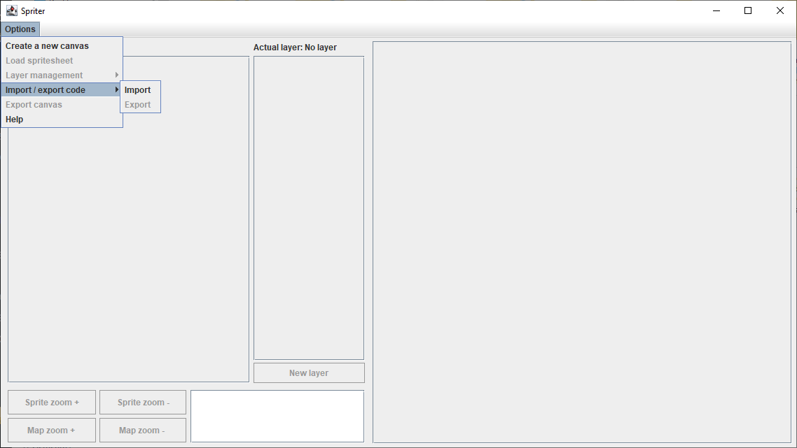

# Introducción

SpriteSheeter es una herramienta pensada para poder gestionar, de una forma más sencilla, un aspecto de uno de los proyectos en los que trabajé.

Empecé un juego 2D de gráficos de tipo pixel art, lo estaba desarrollando para Android con una interfaz de usuario básica a modo de prueba. Aunque el proyecto estaba en una etapa muy inicial, desarrollé el sistema para convertir en objetos individuales cada uno de los sprites de un spritesheet dado. Adicionalmente, este sistema me permite gestionar un canvas de X medidas, adecuando la resolución del mismo a la pantalla del dispositivo, teniendo en cuenta el valor DPI de la misma.

Al tiempo, recuperé este proyecto después de dejarlo abandonado por un tiempo largo. Al intentar acordarme de cómo funcionaba todo, lo primero en lo que pensé fue que la forma de crear el mapa era muy tediosa, necesitaba una herramienta para gestionarlo.

<br>

### El problema :finnadie:

<br>

Nunca he mirado de qué forma se crea un juego 2D de gráficos tipo pixel art. Lo única información al respecto que he recibido de internet, es que la idea principal es trocear la imagen del spritesheet en imágenes más pequeñas para usarlas como objetos dentro del código. Es decir, solo existe un único elemento multimedia.

Entendemos como spritesheet aquella imagen que está compuesta por imágenes más pequeñas, que representan un elemento de cada tipo posible dentro del juego. En un spritesheet también podemos encontrar el conjunto de frames que forman una animación. De esta forma, en un juego como Mario Bros, el suelo está formado por la repetición de un único cuadrado de piedra, las largas plataformas flotantes de ladrillo están formadas por el mismo bloque de ladrillo repetido un número determinado de veces, etc.

Al final terminé con un sistema que dividía el spritesheet en imágenes más pequeñas que podía usar como sprites. El sistema los creaba de forma anónima, la identidad la recibían por parte de una colección de tipo Map, que asignaría a cada sprite un elemento key cuyo valor sería un número. De esta forma, el primer sprite de la esquina superior izquierda sería el sprite 0, el siguiente sprite de esa primera fila sería el sprite 1, y así sucesivamente, en función de las filas y columnas del spritesheet. Entendiendo esto, se puede construir una imagen más grande, a partir de imágenes pequeñas, mediante el ID de cada sprite.

<br>

<p align="center">
  
</p>

<br>

Imaginemos que lo que se ve en la imagen anterior es, un arbol... 😵. El árbol de la izquierda es el spritesheet, tiene un modelo de cada sprite que forma el árbol. A base de repetir algunos de esos sprites se ha creado un árbol mayor en la imagen de la derecha. Si construimos el sistema adecuado, uno que permita, a partir de un listado de ids, crear una imagen con los sprites correspondientes a cada id, podremos crear mapas a partir de arrays bidimensionales, teniendo un único elemento multimedia, el spritesheet original.

```
int[][] newMap = {
{0, 1, 2},
{3, 4, 5},
{3, 4, 5},
{6, 7, 8},
{9, 10, 11},
{9, 10, 11},
{12, 13, 14},
};
```

El sistema iteraría sobre el array newMap, siendo que cada array dentro newMap representaría una fila del canvas, y los elementos de cada fila serían los sprites de la misma. De esta forma, todos los elementos número 0 de cada array forman la columna 0, los elementos número 1 forman la columna 1, y los elementos número 2 forman la columna 2. Este ejemplo es fácil de seguir, es una imagen pequeña, crear arrays bidimensionales se complica cuando el mapa a crear es más grande y/o complejo.

<br>

<p align="center">
 <b>Test canvas</b>
 <br>
 <br>
  
   
 
</p>

<br>

La última imagen de la derecha, arriba mostrada, se forma a partir de la superposición de las cuatro capas previas. Cada capa consta de una serie de sprites.

<br>

```
int[][] default_layer = {
{169,169,169,169,169},
{169,169,169,169,169},
{169,169,169,169,169},
{169,169,169,169,169},
{169,169,169,169,169}
};

int[][] new_layer = {
{0,0,0,0,0},
{104,104,104,108,56},
{209,209,209,159,56},
{311,311,311,312,0},
{412,412,412,413,0}
};

int[][] new_layer_2 = {
{216,216,216,0,0},
{216,377,378,0,0},
{216,428,429,474,475},
{216,216,216,525,526},
{0,0,0,0,0}
};

int[][] new_layer_3 = {
{71,72,216,216,66},
{122,123,124,0,0},
{173,174,0,0,0},
{224,227,0,0,0},
{0,0,0,0,0}
};

```

<br>

Como se puede apreciar, intentar crear los arrays bidimensionales de una imagen tan simple como esa, un canvas de 80x80 pixels con 5 sprites por fila, cada sprite de 16 pixels de lado, puede llegar a ser bastante complicado. Intentar lograr dicha hazaña para mapas grandes, de varios cientos de sprites por lado e incluso más, queda descartado.

<br>

### La herramienta 🧰
 
<br>
  
<p align="center">
 
</p>


<br>

A la vista queda que no soy ningún profesional a la hora de crear interfaces de usuario 😆. Pese a ello, cumple con lo que buscaba.

>>> Esto ha cambiado.
Lo primero que se nos muestra al ejecutar la aplicación es una ventana donde aparecen como inactivos todos los campos, excepto las opciones: _Create a new canvas_, la opción _Import_ dentro del menú _Import / export code_ y _Help_. Esto se debe a que el programa limita las acciones del usuario a la creación del canvas en primer lugar, para poder ejecutar el resto de acciones, o a importar algún archivo guardado previamente. Por último, se puede consultar el cuadro de ayuda, donde se indica lo anteriormente comentado así cómo indicaciones acerca de los atajos de teclado.
>>>

>>> Esto ha cambiado.
Cuando se importa un archivo de guardado, el programa toma del archivo todos los datos necesarios para la configuración del canvas, del spritesheet y de las capas ya creadas. Cuando se crea un nuevo canvas, se abre una nueva ventana donde se solicita el tamaño del lado del sprite y del canvas. Al introducir valores numéricos válidos, es decir, valores positivos, se crea el canvas. El siguiente paso sería añadir un spritesheet válido, es decir, un archivo de tipo imagen. Hecho esto, a la izquierda encontramos un apartado en el que se muestran un conjunto de botones con la imagen de cada sprite, del spritesheet facilitado. En la parte superior del conjunto de botones, encontramos un único botón, de mayor tamaño, con el nombre _Empty sprite_, el cual servirá para imprimir un "espacio vacío" en el canvas. En este caso se está usando un [spritesheet](SpriteSheeter/Resources/tiles.png) del artista . Haciendo clic en cada uno de ellos, se podrá imprimir dicho sprite en el cuadrado rojo dentro del canvas que aparece en la parte derecha del programa. En el medio, se encuentra una lista con los botones de acción de cada capa. Cada checkbox radial ocultará la capa a la que acompañe, y cada botón de capa establecerá la capa actual sobre la que se imprimirá cada sprite.
>>>

Se podrá mover el cursor, el cuadrado rojo, sobre el mapa, mediante las teclas de dirección o mediante las teclas _a w s d_. Adicionalmente, manteniendo la tecla Shift y presionando alguna de las teclas de dirección mencionadas anteriormente, se podrá mover el spritesheet dentro del apartado _Sprites list_. Presionando Shift más la tecla +, se aumentará el tamaño de visualización de los sprite dentro de la lista de sprites; ocurrirá lo contrario si la combinación de teclas es Shift y la tecla -. Se podrá modificar el tamaño del canvas si se presiona la tecla Ctrl y las teclas + y -. La tecla Enter modificará el estado del cursor, pasando de color rojo a color verde. Esto indica que se imprimirá, automáticamente, el último sprite que se haya seleccionado con el ratón en la lista de sprites, en cualquier ubicación a la que se mueva el cursor, hasta que el cursor vuelva a ser de color rojo.

>>> Esto ha cambiado.
En la parte superior izquierda se encuentra un menú desplegable que permite realizar diversas acciones. Se puede crear un nuevo canvas; cargar un nuevo spritesheet; gestionar las capas, pudiendo borrar o eliminar la capa actual, o todas las capas a la vez; importar o exportar un archivo de texto _.txt_ para poder guardar o cargar el trabajo realizado; exportar en formato _.png_ el canvas actual, siendo que las capas ocultas no se imprimirán; o leer una pequeña leyenda donde se informa de los atajos de teclado.
>>>

>>> Esto ha cambiado.
Por último, en la parte inferior izquierda se encuentran una serie de botones para controlar el nivel de zoom aplicado sobre la lista de sprites y sobre el mapa; un bloque de texto donde podemos escribir el nombre de las capas que deseemos agregar, o donde se mostrará el texto generado cuando se seleccione la opción de exportar código; y el botón de _New layer_, que creará una nueva capa tomando como nombre el texto que hayamos introducido en el campo de texto.
>>> 

<br>

<p align="center">
 
</p>

<br>

### El fruto 🍓🍌🥝
 
<br>

El objetivo final de la aplicación no es conseguir la imagen final, el canvas es solo la guía para que aquel que está creando el mapa. El objetivo final es obtener el bloque de código generado en el archivo .txt al seleccionar la opción _Export code_.

<br>

>>>Est
```
//Sprites in side = 5

//Sprite side = 16

##PATH##

-
//Layer: water
int[][] water = {
{170,170,170,170,170},
{170,170,170,170,170},
{170,170,170,170,170},
{170,170,170,170,170},
{170,170,170,170,170}
};
//water:170 170 170 170 170 170 170 170 170 170 170 170 170 170 170 170 170 170 170 170 170 170 170 170 170 
-
-
//Layer: ground
int[][] ground = {
{0,0,0,0,0},
{108,108,108,109,0},
{159,159,159,262,0},
{310,310,310,313,0},
{411,412,413,414,0}
};
//ground:0 0 0 0 0 108 108 108 109 0 159 159 159 262 0 310 310 310 313 0 411 412 413 414 0 
-
-
//Layer: bridge
int[][] bridge = {
{0,0,0,0,0},
{0,378,379,0,0},
{0,429,430,475,476},
{0,0,0,526,527},
{0,0,0,0,0}
};
//bridge:0 0 0 0 0 0 378 379 0 0 0 429 430 475 476 0 0 0 526 527 0 0 0 0 0 
-
-
//Layer: tree
int[][] tree = {
{72,73,0,0,0},
{123,124,125,0,0},
{174,175,0,0,0},
{225,228,0,0,0},
{0,0,0,0,0}
};
//tree:72 73 0 0 0 123 124 125 0 0 174 175 0 0 0 225 228 0 0 0 0 0 0 0 0 
-
-
```

<br>

>>> Esto ha cambiado.
Este es el contenido del archivo _.txt_ para la imagen _Test Canvas_ arriba mostrada. Empezamos mostrando el número de sprites por lado del canvas. A continuación, el número de píxeles, por lado, de cada sprite. El campo ##Path##, que mostrará la ruta hacia el directorio en nuestro equipo donde tengamos almacenado el spritesheet. Las tres primeras líneas, y las líneas "//nombre_de_capa:sucesión_de_numeros", son las que se usan para reconstruir el trabajo en el programa al importar el archivo. Finalmente, la declaración del array, así como el comentario con el nombre de la capa, es lo que se copiará y pegará en la declaración de mapas en el proyecto del juego mencionado en la introducción.
>>> 

<br>

### Conclusión 🙌

<br>

>>> Esto ha cambiado.
No es un proyecto brillante; cada vez que lo reviso descubro cosas que pulir, estructuras que mejorar, funcionalidad que se le podría añadir o retirar, fallos que corregir, objetivos pendientes en la lista _//todo_, y un largo etcétera de consideraciones que cualquier experto podría agregar. Adicionalmente, siento que lo dejo incompleto. Por lo general suelo documentar los proyectos que hago de forma exhaustiva, explicando línea por línea, y este proyecto, así como otros en mi Github, va a quedarse sin ese tipo de documentación, sencillamente por ausencia de tiempo.
No he inventado nada nuevo; ya existen herramientas como esta y mejor desarrolladas, no obstante, este proyecto me ha servido para seguir mejorando, para seguir practicando la gestión de un layout, la exploración y manejo de archivos, continuar mejorando mis buenas prácticas, etc. Además, si acaso en algún momento continúo desarrollando dicho juego, cosa que no es mi prioridad, me será de gran ayuda.
